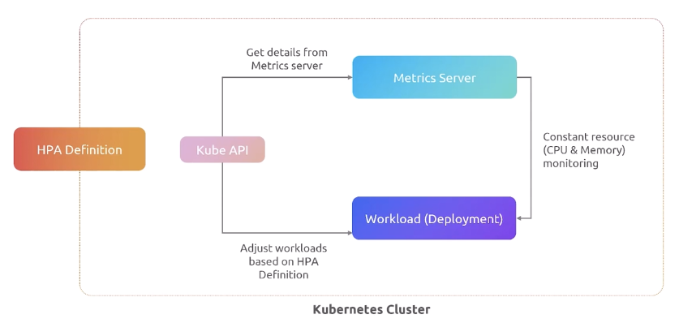
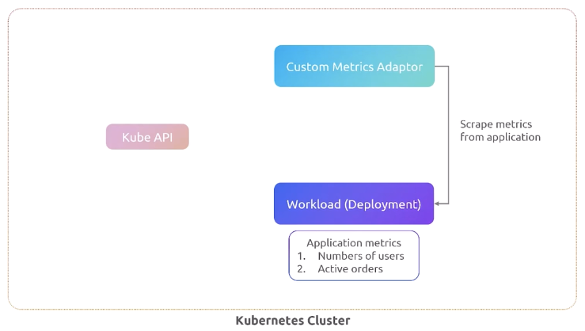
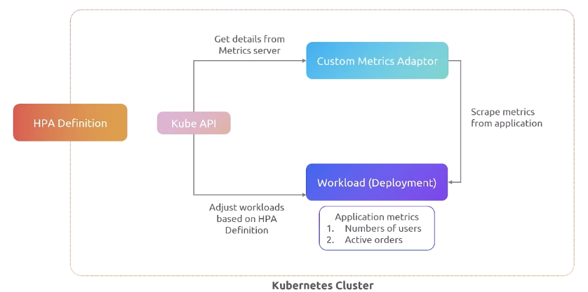
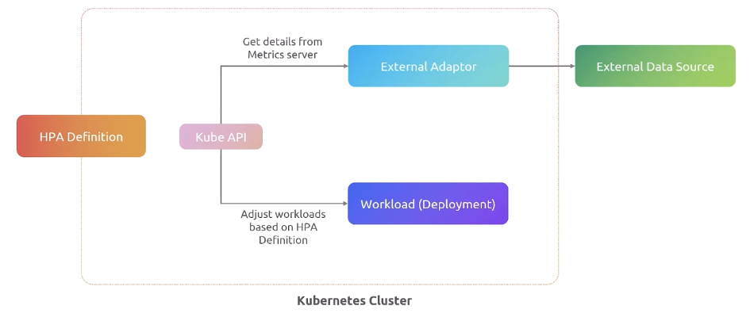
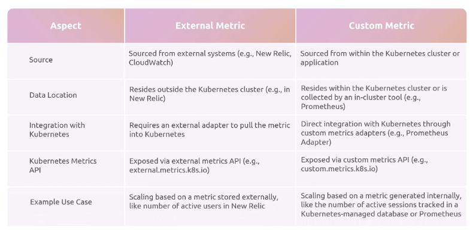
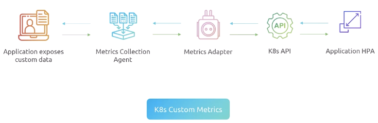

# Horizontal Pod Autoscaling

## What is HPA?

Welcome, everyone. We're going to dive into something that's probably going to seem a little bit technical at first glance, but it is Kubernetes. So it is going to be technical, isn't it? Right. I mean, isn't everything in Kubernetes technical because it's a technical tool? Anyway, ignoring waxing, let's talk about the Horizontal Pod Autoscaler. 

So why do we need the Horizontal Pod Autoscaler for short? What do we need it for? To get to the heart of this, let's use an analogy. OK, so we have a factory. The factory has a steady team that meets everyday production needs, ticking along nicely, producing work day in and day out. Everything is smooth sailing because the workload is predictable. They produce a fixed number of units. They don't really change anything. But then what happens when things change? How does the factory handle changes in demand? Let's find out what happens next. So there's an increase in demand. The factory suddenly gets a rush of customer orders or maybe experiences some kind of seasonal demand spike. It is right after Christmas in 2025. So the usual workforce just can't keep up with this need. They are not able to handle it. And this is very similar to our experience when our apps are experiencing a customer spike due to user activity, demand surges unexpectedly, and we need a way to handle it efficiently. How do we address this? So the factory, by the way, is tracking some metrics, right? The factory keeps an eye on some crucial metrics. For example, they track order volume and processing, stock levels, custom order requirements, and they use this to decide, right, when they need to bring in more workers. 

Similarly, in a tech environment, we do the same thing, right? We have metrics. For example, if a product stock falls below a certain threshold due to high demand, then we know that, you know, we need to basically bring in more staff. If custom metrics are requiring more handling than usual, then we're going to have to bring in more staff. So we basically have to increase our team, right, the number of workers we have in order to process this additional load. Now, this is exactly what the Horizontal Pod Autoscaler does. The Horizontal Pod Autoscaler is the tech world equivalent of the factory's smart workforce assessment or smart workforce management system. Think of the HPA as your system that monitors key metrics, like CPU, memory, right? And it basically adjusts requests in your cloud resources, like your pods in this particular case, much like you would add more workers to your factory. Now, the magic of HPA lies in its ability to respond dynamically to changes automatically without your, with minimal manual intervention, ensuring efficiency and reliability. So how does the HPA do this? What does that look like? Well, the HPA is like a very vigilant supervisor. It `observes metrics` such as CPU usage, like our factory keeps an eye on, you know, stock volumes and pieces like that. So when demand surges beyond a threshold at a certain interval, the HPA steps in and it `adds pods`, much like hiring extra workers to handle a rush. And it's all about `maintaining balance`. 

HPA is going to scale up aggressively when necessary and scale down conservatively once things come down. 

So it's trying to maintain some balances and throw some thresholds. Now, `you can track multiple metrics` if you need to, but this is how the HPA stays responsive to your application needs because you can track the metrics you need. We'll mention that by default, the HPA tracks some very basic metrics, but you can expand that if you need to. This is basically the Horizontal Pod Autoscaler. It is a supervisor for the capacity of your application, and it adds more instances of the application as needed to make sure it stays in alignment with thresholds to metrics that you defined. So we're going to talk more about the Horizontal Pod Autoscaler (HPA). This isn't our first conversation.

## HPA Architecture

Hello, everyone. We're going to continue our discussion about the Horizontal Pod Autoscaler, also known as the HPA. And we're going to talk today about its architecture and its workflow. So we're going to unravel some of those intricacies. Okay, so what exactly is the HPA architecture framework? Okay, so at its core, HPA is all about dynamically adjusting the number of pod replicas in a deployment. Replica set, it could be a stateful set also. So it's not just limited to the deployment workload. It could be any workload. So imagine, you know, you're adjusting basically the number of application instances inside these types of workloads. So it could be deployment, it could be a stateful set, could be a straight-up replica set, which is rarely manipulated now. We usually do that through a deployment, but that's the idea, right? 

So traditionally, HPAs relied on two primary metrics to basically know whether you need more instances of your applications. Think of these as the kind of native heartbeats of your system monitoring. These are going to help you keep things in peak condition. Does your application have enough CPU? Is it over a certain threshold? Does your application have enough memory? But what if it needs more than just monitoring like the basics? What if it needs more than just traditional kind of native HPA? What if you need to track how many users are active or how many orders are being processed? That's where `custom and external metrics` come into play. They really give us the flexibility to tailor scaling to our specific needs. So let's explore that. So, advanced HPA could require us to use those custom and external metrics that we were just talking about. 

Now, HPA, by the way, has a few components. First, we have the `HPA resource definition`. This is going to outline the target workloads, the scaling rules, and then there's the `metrics collection source`, right? So we have to be able to talk about where our metrics are available. We have to talk in some cases to a `metrics API`, right? Which this is going to ensure, by the way, metrics can be queried through the correct API channels. And we might actually need `adapters`, particularly if we are using custom or external metrics. 

If we're using the native metrics, metric adapters are not really necessary. 

So let's talk about the HPA resource definition first. Okay, so this is the blueprint, by the way, where scaling is laid out. It specifies the workload deployment, defines how scaling should occur, right? And so if we look at the YAML file here, right, you'll notice that we're talking about the kind of workload, in this case, a deployment, right? The kind of object really, but in this case, it's a deployment. We're also specifying the minimum and maximum number of application copies, also known as replicas, that we're willing to run. So we'll go down to a minimum of two, but we want a max of 10. Think of this as the rules of engagement for your application scaling. Next up, we've got the metrics collection source. Now, in this case, we're just talking about a native Horizontal Pod Autoscaler resource. In this case, it's CPU utilization with an average utilization of 50% across the time that the metric is submitted and that HPA checks it, which by default is every seconds. So this is a vigilant guardian who's going to be watching the system to make sure that CPU utilization for our applications does average around 50%. So this is important. Now, that's the resource definition. 

```yaml
# HPA.yaml
apiVersion: autoscaling/v2
kind: HorizontalPodAutoscaler
metadata:
  name: my-app-hpa
  namespace: default
spec:
  scaleTargetRef:
    apiVersion: apps/v1
    kind: deployment
    name: my-app
  minReplicas: 2
  maxReplicas: 10
  metrics:
  - type: resource
    resource:
      name: cpu
      target:
        type: Utilization
        averageUtilization: 50      
```

What about the metrics collection sources? What about that? So within the Kubernetes cluster, these sources are critical because whether they're internal to the cluster, internal to a pod inside the cluster, or external to the cluster, the metrics collection is pivotal because this is the data, this is the number that's going to determine whether we scale or not. So you've got the Kube API, and `by default, you have to have a metrics server for HPA to function`. And so it's going to use the metrics server to get CPU and memory from the workloads, and it's going to get those details. And so the HPA definition is going to be looking at those thresholds, and it's going to basically adjust the number of deployment workloads. It's going to adjust the number of pods, the replicas inside that deployment based on what it's getting from the API, which is talking to the metrics server. So this is important because we're sourcing this inside the cluster, and these are pretty much natively available. 



Now, if we shift this, let's talk about what happens when we have a deployment, we've got a replica set, we've got our resources, CPUs, we've got all this set, and we're now shifting to custom metrics. So this was an example of just the standard resource definition that we saw before. What happens when we're pulling metrics from a custom source? Now, this is a little misleading because **`custom sources actually still act inside the cluster, meaning that the custom metrics adapter that we're looking at is actually scraping metrics from another pod or another object inside the Kubernetes cluster`**. 



So, you know, this is `custom.metrics.k8s.io` as far as the URL, and what's going to happen here is that it's actually maybe scraping another pod for the number of users or active orders inside the cluster. So don't be fooled, custom metrics are pulling metrics from another application or another object inside the cluster. So the Kube API is going to get details from the metrics server, or in this case, this custom metrics adapter, and HPA is going to look at that and it's going to adjust the workload based on what it sees through that API call, through that number. Now you get to set those thresholds, so this isn't just arbitrary, you actually set this up. But the key takeaway here is that custom metrics are still inside the cluster, they're just not necessarily a native object inside the cluster. In this case, we could be pulling from pods. 



Now, in this particular case, you usually either see pods or you could actually say, see another type here called a container, but notice the kind doesn't change, in this case, it's a deployment. Replicas and minimum and max both remain the same, but the type here is what shifts. Now notice in this case, we're actually talking about an in-cluster metric that's being surfaced through an adapter, we're actually pulling it from another pod. We could also pull it from a specific container in a pod, that's another type that could be there called an container. Notice here that we're looking at the HTTP requests per second, and we're looking at the average value of 100. So if that exceeds that, or it's not close to that average, it's gonna, the HPA is going to act at that point in time. Reminder, custom metrics are still inside the cluster. 

```yaml
# HPA.yaml
apiVersion: autoscaling/v2
kind: HorizontalPodAutoscaler
metadata:
  name: my-app-hpa
  namespace: default
spec:
  scaleTargetRef:
    apiVersion: apps/v1
    kind: deployment
    name: my-app
  minReplicas: 2
  maxReplicas: 10
  metrics:
  - type: Pods
    pods:
      metric:
        name: http_requests_per_second
      target:
        type: averageValue
        averageValue: "100"
```

Okay, so then what about the third type? Because we've talked about native in a sense, by using CPU resource management, we've talked about custom metrics, right? And now we're talking about external metrics. What's the distinction? Well, external metrics are actually pretty straightforward. They're external to the cluster, but you get to them through the Kube API through an external adapter. And that adapter is actually talking to an `external data source`. Now that could be a variety of different things. So don't be fooled. You could be talking to a cloud provider. You could be talking to an application in another cluster. You could be talking to any kind of API calls or webhooks, right? So HPA, just like it did with custom, and just like it did with just straight up metrics, is actually gonna look at the thresholds you define, look at the numbers, and then reconcile the number of replicas in the workload based on your HPA definition. 



So nothing really special here, except the metrics are external. By the way, this could pull from Datadog or Dynatrace or some other external logging system. It doesn't even necessarily have to be inside your infrastructure, as long as the cluster can get to it. So here, notice that the type is set to external. So this is, notice the type here is set to external. So deployment's the same, replicas are the same, but notice that this changes. And look at this, they're actually talking to New Relic. **`Now, I want to be clear that an adapter object is installed inside the cluster that makes this name make sense.`** This name, New Relic, is actually linked to an adapter that's installed into the Kubernetes framework so that when HPA goes and looks for that metric, it's actually talking to an adapter that is pulling that information. Notice, by the way, if the response time, the value is 500, in this case, it's milliseconds. If it exceeds milliseconds, then HPA is gonna scale. 500 milliseconds, that's generous. 

```yaml
# HPA.yaml
apiVersion: autoscaling/v2
kind: HorizontalPodAutoscaler
metadata:
  name: my-app-hpa
  namespace: default
spec:
  scaleTargetRef:
    apiVersion: apps/v1
    kind: deployment
    name: my-app
  minReplicas: 2
  maxReplicas: 10
  metrics:
  - type: External
    external:
      metric:
        name: newrelic.app.response_time
      target:
        type: Value
        value: "500"
```

Okay, so then what about metrics API availability? So one thing to note is that `metrics.k8s.io` refers to the metrics server, and it refers to, that's where you're gonna get the CPU and memory metrics. So that's where, this is your default. Now, if we talk about `custom.metrics.k8s.io`, notice that's a prepend to the metrics.k8s.io we were just looking at. That's for custom metrics. These are application-generated, so they are inside the cluster, either exposed by the pod or in a specific container in a pod. So this is within the cluster. And then there's external metrics, and these are externally generated. They originate outside the cluster, but they are linked into the Kubernetes framework through the `metrics adapter` that you install so that the metrics server that talks to HPA can actually pull them straight from the metrics, the Kubernetes API. So that's why it's linked to `external.metrics.k8s.io` or custom.metrics.k8s.io, right? 

So the metrics adapter, which I've referred to several times is a piece of software that gets installed into Kubernetes, and it has a bridge to either external sources outside the cluster or a bridge to internal data sources. And so they are crucial for bridging the metrics sources so that they can run natively in Kubernetes. The metric adapters are gonna allow the HPA to utilize metrics that normally are not available to it. Think of them as interpreters, translators, sources, data sources, if you will. And so the difference here around these metrics is that external metrics are sourced from external systems, custom metrics are actually inside the cluster, and they're either an object in the cluster or they're an application in the cluster. Notice that externals reside outside, custom metrics reside in the cluster. Both require some kind of metrics adapter, but one requires an external adapter and the other requires some kind of custom metrics adapter. Like in this case, the Prometheus adapter, right? You could pull custom metrics from Prometheus, which looks like an object inside your cluster. Notice that the external API is external.metrics.k8s.io, the custom one is custom.metrics.k8s.io. So number of use cases here, but basically you can service all kinds of metrics with both external metrics outside of the cluster and custom metrics inside the cluster. There are some considerations here when thinking about this. 



One, there is a control loop, right? **`So every seconds, HPA is gonna use a loop to basically check against the thresholds and targets that are defined in the system.`** You can change this by the way. And so at that time, it's gonna make decisions about updating the number of replicas or upgrading the workloads, right? It's gonna do that every seconds, it's gonna check those metrics, it's gonna make a decision. So it's gonna constantly be checking and adjusting the environment as needed. 

So HPA operations flow is that first thing it's gonna do is it's gonna retrieve metrics, it's gonna evaluate the metrics, it's gonna basically scale if it needs to based on whether or not the threshold has been compromised or not, and then it's gonna update the deployment in the workload. So these are the four steps that the HPA is going to take when it runs its control loop every seconds. It's gonna retrieve some metrics, evaluate the metrics against the thresholds, if the thresholds are violated, it's gonna do a scaling calculation, and then it's gonna update the deployment with the scaling recommendation. Now, how does it scale? Well, we're gonna talk about that, but basically you get to control it. That's the main thing to know. 

Other considerations are that you do have to have a metrics server, right? The metrics server does have to be running inside Kubernetes, it is not always installed by default. You do have to have some way to evaluate the metrics, so make sure that you've got metrics available, right? Whether custom, external, or internal, and then you are gonna have to define some level of scaling behavior. Do you want it to scale a certain number of replicas at a time? Do you want it to grow 100% or 50% every time it crosses the threshold? You will have to think about how you want to scale, and you can actually set multiple types of scaling behavior, so you're not limited. Okay, well, that is all of the details around architecture for the Horizontal Pod Autoscaler. We will do some labs and get hands-on with this, but that should give you a better understanding of how the HPA functions. We'll catch you in the next video. 

## Custom Metrics - Mechanisms

Welcome back, everyone. I am delighted to talk to you about custom metrics and some of the mechanisms around custom metrics. So we've mentioned the native metrics already, so let's talk about how custom metrics work because these are a little different. One, we know the custom metrics exist and that the HPA can talk to them just like it can talk to native metrics, which in this case are CPU and memory, or it can talk to external metrics, which we'll talk about here in the future. These are application-specific metrics that are inside the cluster. So the idea here is that using custom metrics can enhance scaling based on, for example, your application's performance indicators. You might actually surface your application's metrics, such as latency, the number of items, the queue depth, any of that, and scale based on your application. This could be a variety of different things, the request rate, the latency of your application, queue lengths, it's not just an arbitrary number, they're crucial indicators of your app's performance, and so this can help you both increase your app's performance and therefore keep customer satisfaction high. 

So how do we bring these metrics into picture for HPA? Let's look at the components that make this happen. So here we are, we're gonna look at the components, right? And the workflow that brings custom metrics to life in Kubernetes. Now it's a bit like a relay race. First, your application needs to expose the desired custom metrics. This is often done through some kind of monitoring library. Then, for example, a monitoring system, for example, like Prometheus, will have some kind of agent that collects these metrics, and then what it does is it's going to run through the adapter and put the metrics into some kind of system or API. Now, it collects the metrics, and the metrics adapter basically is gonna make it so that the K8s API can talk to either the collection agent and the collection database to translate these metrics into a language that Kubernetes can understand, and HPA is gonna talk to the Kubernetes API. I know that sounds weird, but the application is gonna expose the data, the metrics collection agent is gonna collect it both through agent and datastore. The metrics adapter is gonna make the K8s API able to talk to Prometheus, and then the application HPA is gonna talk through the API and get the metrics that it needs. So the HPA is gonna use this data to adjust the number of pod replicas based on the current needs. 



Does it sound like a lot? Well, hold on, let's break it down a little further. Okay, so you do need the metrics server, by the way. So here's the problem, though, is that the default Kubernetes metrics server doesn't support custom metrics. So this is, for example, why you might put Prometheus in here, which is its own metrics server. So you're gonna make sure that your monitoring system and your agents can collect and expose the metrics in a format that the adapter can understand. Now, the adapter is an installed piece of software. So like Prometheus has an adapter, for example, that gets installed so that you can talk through Kubernetes to the Prometheus server. And so these monitoring systems and adapters and agents all work together so that Prometheus can make metrics available to HPA, which is only gonna talk to Kubernetes. So the idea here is that you need the agent, the collector, the adapter configuration, because HPA is only gonna talk to K8s. But reminder that for custom and external metrics, the native metrics server does not actually expose custom metrics. So when we talk about custom metrics, we're really talking about in-cluster custom data sources. This could be Prometheus, this could be other metrics servers, but that's the whole idea, is that custom is talking to something that's not the native metrics server. We'll catch you in the next video. 
