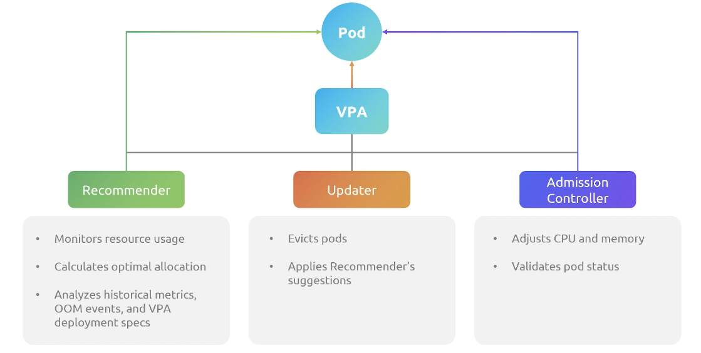
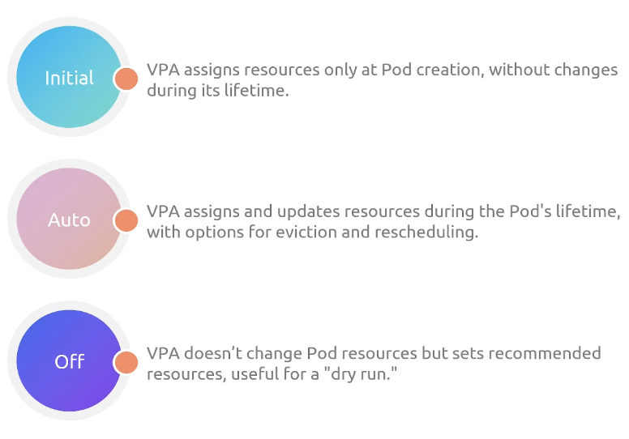
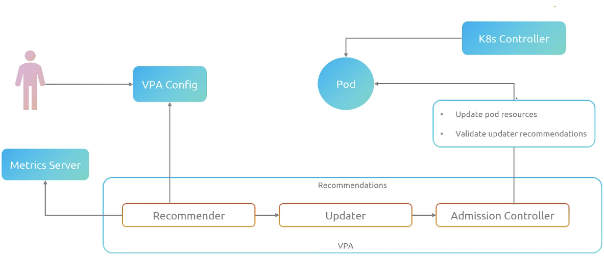

# Vertical Pod Autoscaler

## VPA Architecture

Welcome everyone, we're going to dive into the Vertical Pod Autoscaler. This entire section is all about the Vertical Pod Autoscaler because we just actually left the Horizontal Pod Autoscaler. So we're going to take a little journey here through the VPA architecture, talk about some of the details. Okay, so let's get into it. Why do we even need the VPA? Because if we have the Horizontal Pod Autoscaler, why do we need the Vertical Pod Autoscaler? Well, you may remember that Vertical Scaling and Horizontal Scaling are very different. Vertical Scaling is all about increasing the actual capacity of a single application, whereas Horizontal Scaling is all about adding more instances of an application. 

So then why do we need the VPA? Why are we talking about this? Well, imagine this, you've got a bustling cafe, it's in the heart of the city, right? And this isn't just any cafe, it's the most popular spot in town and it is packed with customers all day long. And you have a diverse team, talented baristas, you've got some chefs, you've got some waiters, they're very attentive, they're on point. And every morning, you have to guess how many staff members you need for each role. But it's a little bit like playing a game of whack-a-mole, it's gambling. Sometimes you get it right, but other times not so much. And so you got to keep this cafe scene in mind as we proceed, because it's relevant for understanding the need for VPA. All right, so continuing with our cafe analogy, right? Picture this. Some mornings you nail it, staff is perfectly balanced, everything flows seamlessly. But what about those days when things go haywire? You've got too many baristas standing idle while the kitchen is in chaos. It's like a bad drama where suddenly everything goes off script. And so you need some kind of intelligent system, like the VPA, that comes in and helps figure out how to right-size everything that you've got from a staffing perspective. Think of the VPA as your cafe wizard. They're the manager who's observing everything in real time and is going to adjust the staff roles as needed, right? So to say this, if the barista is idle, for example, or the waiter's idle, maybe it can come in and help. Maybe it can help with the back-end, maybe it can help shepherd food. And so if suddenly we have an influx of caffeine-craving customers, we can relocate staff to the areas that we need them in, and so constantly reallocate resources on where we need them most. 

That's really what the VPA does, is it basically allocates resources, the size of resources, when and where we need them. So the VPA's job is to continuously monitor and adjust the CPU and memory resource availability based on real-time workloads. So if you think about having, for example, a single pod, and now remember a pod always contains a container, no pun intended, that has an application in it. And so in this world, if the pod needs more resources, then basically what the VPA does is it finds the sweet spot to increase the size as necessary based on the workload that's coming in. So this will avoid, by the way, things like slowdowns, crashes. And so the idea here is that if we need a bigger instance, what will happen is it will upsize and automatically assign the right resources to make sure the size is exactly where it needs to be for the load that it's getting. So imagine the kind of peace of mind this kind of thing will bring, because you basically, in this case, don't have to worry about upsizing your pod to make sure the application has the right resources. You can add CPU and memory by just initiating a new copy, and the VPA does that. Basically, it changes the resource limits on a pod's access to CPU and memory. 

Now, what's even more powerful is that **`VPA can dynamically adjust the CPU and memory to meet demand`**. It can also keep applications efficient, meaning it can right-size you, meaning upsize and downsize as necessary to make sure you're also not losing money by having an oversized application. So it works both on the upscaling and the downscaling pieces. 

Now, there are a couple of components to VPA. It's got three in particular. It's got the **`recommender`**, the **`updater`**, and the **`admission controller`**. So the recommender's job basically is to **`monitor resource usage`** and make sure that there are **`optimal allocations`** for CPU and memory. Basically, this **`analyzes historical metrics, out-of-memory events`**, and the deployment specs that are around the VPA, so whatever has been defined for the VPA, and the recommender makes recommendations. 

Now, the updater does what you think it should do. Basically, `start pods`, `apply the recommender suggestions`, `evict old pods`, and it basically will make sure that the recommendations that the recommender makes are actually updated and put into production, if you will. 

Now, the admission controller basically is the one that `adjusts CPU and memory` before the new pods that the updater requests start. So these components basically work together to create a seamless system that makes sure that your applications are all running at the size that you need them to run at. So recommender, updater, and admission controller all work together to make that happen.



Now, VPA has a few modes outside of its three components, which you can define in configuration. These modes basically determine how resource assignments are handled. So **`initial mode`** is basically going to only assign resources at pod creation, so it will not adjust after it launches. **`Auto`** is a VPA mode where it's going to assign and update resources during the pod's lifetime. This includes when it's first initialized. This includes when it basically evicts it, when it reschedules it. So basically, auto means it's just going to do whatever it can to make sure it stays within the limits you've defined for VPA. **`Off`** basically doesn't change any resource constraints at all, but it does actually set recommendations. So this can be useful for things like a dry run, where you want to see what kind of recommendations it would make. Each mode serves different needs, basically providing flexibility in how VPA can be deployed. 



Now, let's take a look at some real-world scenarios for VPA in action. So let's do a little walkthrough. First, a user comes in and configures the VPA. Now the recommender is going to read the configuration and the current resource usage namely the metrics, and it's going to suggest updates. So the user has made a change to the VPA config. This is going to suggest updates to the recommender, which is going to read that configuration, make some recommendations. The updater, after the recommender talks to the metrics server and reads the configuration, the updater is going to give some information and then what it's going to do is it's going to do something to the pod. So notice in this case, small pod size, larger pod size. So it's going to apply new resource limits. Now during this recreation process, the admission controllers will have actually changed the new pod's specs. So the updater will actually talk to the admission controller before it actually launches that new pod to change the resource limits. And so the admission controller is going to inject the updated request into the new pod specs, validate the updater's requirements, and then you're going to get that new pod launch, which the case controller is going to see. So this is going to ensure optimal resource allocation, much like our cafe wizard manager, who's going to make sure that every staff member is perfectly placed in the position needed at the time that it is needed. So that's our walkthrough through basically VPA and some of its core components.



## VPA Setup

Welcome back everyone. Let's talk about our demo setup for the Vertical Pod Autoscaler. But before we do that, we need to talk a little bit about some of the groundwork here for a discussion point known as Custom Resource Definition, or definitions, known as the CRD. Alright, Custom Resource Definition. So if you haven't heard this, here we are with Custom Resource Definitions or CRDs. Think of CRDs as a way to teach Kubernetes new tricks. CRD basically lets you create custom resources that are not built into Kubernetes. Typically, Kubernetes knows how to handle certain resources like pods and services, but what if you need something more? CRDs basically come to the rescue by letting you define what your cluster can manage beyond the default object setup. So imagine it as being able to expand the vocabulary of Kubernetes to include new words like Vertical Pod Autoscaler. So with CRDs, we can introduce custom behaviors and configurations. And these basically custom configurations can be tailored to your specific needs, right? This is kind of exciting because this is what makes Kubernetes extensible. You can literally take a K8s cluster and expand its capabilities. So you can actually make it so that, you know, behavior for pods and services, and even the VPA in this particular sense, that these behaviors are extended. 

So Custom Resource Definitions are the reason that the VPA can work the way it does, because it basically is an extended piece of code that is inserted inside of Kubernetes that allows for different kinds of behavior. So now that we've got an idea about CRDs, let's talk about why these Custom Resource Definitions, how they relate to the Vertical Pod Autoscaler. So there are two main types of CRDs for VPA. There's the **`Vertical Pod Autoscaler CRD`** itself. So this is a Custom Resource Definition for the VPA. And then this one, by the way, is going to monitor container CPU. It's going to monitor container memory. So it's concerned with what's happening currently, where you have tuned VPA to look at. Now the **`Vertical Pod Autoscaler Checkpoint CRD`**. So this is a Custom Resource Definition for the checkpointing that the VPA does. This is all about historical container CPU and historical container memory. So think of the VPA, like the Vertical Pod Autoscaler CRD is like your personal fitness coach for containers. It's going to monitor how much CPU and memory a container needs, and it's going to adjust those resources over time. It's all about efficiency, just giving enough resources without going overboard. With the Vertical Pod Autoscaler Checkpoint CRD, this one acts like a diary. This one's going to keep track of your performance, including your historical CPU and memory usage. And it's going to be invaluable for making informed decisions for like if a change ever occurs, like a container restarts. So with these two CRDs, the VPA becomes a really dynamic tool in resource management. And it becomes honestly a really smart way to handle workloads. It'll now allow you to upsize your CPU and memory as needed. So let's explore how these concepts come together in a practical demo. 

## VPA Memory

Welcome students. We're going to talk now about the memory lab that we're about to do for VPA so you can see VPA in action. Let's talk about it. So in this lab you're going to deploy a sample application. It's going to be on Kubernetes. You're going to monitor the application's memory usage specifically and then you're going to use a VPA configuration and you're going to actually look at the recommendations and then you're going to do a load test and then you're going to validate the recommendations. So you're going to deploy a sample app, just a sample Flask app. It's going to create a service. It's pretty straightforward. Nothing fancy. And then you're going to take a look and see what's going on. We're running pods. Good. We see our Flask app running. We're good. Everything's solid. And then we're going to take a look at the current CPU and memory consumption. Notice here it's about 12 megabytes or megabytes, however you want to look at it. So let's take a look at memory usage before initiating the load test, because that's one of the things we're going to do inside the lab. Now, you may remember that we talked about how the VPA, you have upper and lower limits around what is the minimum it will allow it to go down to and what is the maximum it will allow it to go up to. So as we look at this policy, you notice that min allowed and max allowed is clearly defined. Now, this specifies the minimum amount of memory and CPU, in this case, just memory that it's going to recommend. And then you see max allowed is basically saying this is the maximum amount of memory that we will reconfigure the pod for. Notice the control resources here is just a single value in the array. It's just memory, because this is just a memory lab. 

```yaml
apiVersion: autoscaling.k8s.io/v1
kind: VerticalPodAutoscaler
metadata: 
  name: flask-app
spec:
  targetRef:
    apiVersion: apps/v1
    kind: Deployment
    name: flask-app
  updatePolicy:
    updateMode: "Off"
  resourcePolicy:
    containerPolicies:
    - containerName: "*"
      minAllowed:
        memory: 150Mi
      maxAllowed:
        memory: 1000Mi
      controlledResources: ["memory"]
```

So we're going to apply that. And basically, we're going to create a VPA object for the Flask app. Now, this now means that if we run a kubectl get VPA Flask app, obviously it will give us some YAML to look at, we can actually look at the initial recommendations that the VPA has made just by looking at the application in its current state. 

```yaml
status:
  conditions:
  - lastTransitionTime:
    status: "True"
    type: RecommendationProvided
  recommendation:
    containerRecommendations:
    - containerName: flask-app
      lowerBound:
        memory: 262144K
      target:
        memory: 262144K
      uncapppedTarget:
        memory: 262144K
      upperBound:
        memory: 1000Mi
```

Now, there's a few things to focus on here. One, `lower bound`. This is the basically minimum resource request value that is recommended by the VPA to ensure that the application is going to remain stable. This is actually looking at what the app, the pod is actually consuming from a memory perspective. Now, the `target` is basically the ideal request value that VPA recommends to balance resource utilization. Notice that in this case, they match, because there's no distinction. It's exactly where it needs to be. Now, as far as the `uncapped target`, this is basically the recommendation calculated by VPA before looking at the min and max values inside the configuration. This number could actually go above the `upper bound` below, because it's basically saying, well, this is what I recommend without your constraints. And by the way, this is one of the constraints, right? We've got the upper bound and lower bound. And then we've got basically our untapped target. So in this particular case, we haven't changed anything, we haven't put load on the system. 

So what happens if we put some load on the system? So let's say we run a load script. And now we go back after some load has run on the application, what are then the current recommendations? So if we then get the VPA flask app object again inside of Kubernetes, what are we going to see? 

```yaml
  recommendation:
    containerRecommendations:
    - containerName: flask-app
      lowerBound:
        memory: 262144K
      target:
        memory: 511772K
      uncapppedTarget:
        memory: 511772K
      upperBound:
        memory: 1000Mi
```

Well, if we look at the recommendations now, now notice that the lower bound is still the lower bound, but the target memory is basically saying, oh, well, we're going to reconfigure to this. This is the recommendation after we apply the max and mins. And notice that in this case, it's about basically half a gig of memory. Notice that that recommendation doesn't exceed our minimax targets is actually saying, yeah, this would be great. So by the way, just to say this, if the target is at megabytes, and uncapped is at megabytes, you might need to reconfigure the bounds on VPA to allow for 45 megabytes. Basically, what that uncapped target does is it tells you what the app would consume if we weren't putting limitations on it. And typically, by the way, upper bounds, this particular case is actually pretty high. So you might say, Michael, why wouldn't you just uncapped memory? Why wouldn't you just let memory just run amok? Well, one, you probably only want it to grow so large before you look at something like Horizontal Pod Autoscaler. But there are situations where you don't want the application to take necessarily more memory because it doesn't actually create efficiency in the application. At that point, you probably would want to look at Horizontal Pod Autoscaler and add another instance. I can think of, for example, large memory sizes where garbage collection is maybe a little painful, depending on how the application is written. That might be one of those cases.

## VPA CPU

Welcome, students. Let's talk about the CPU lab, which is just the CPU version of the lab that we just did for memory. So, lab overview. So, similar dispositions here. We're going to deploy a sample application. We're going to monitor, in this case, the CPU utilization. We're going to apply a VPA configuration and capture the CPU recommendations. And then we're going to do a load test to validate the recommendations in question. So, in this particular case, notice that we are, once again, immediately just creating basically a CPU testing deployment. Again, this is Flask app in this particular case. And then we're going to do a top, right, just to see exactly how many CPU cores it's using. And notice here that it's using, in this case, mCPU, which is pretty tiny, actually. And what's going to happen is we will have set minimum allowed to mCPU and basically a full CPU, 1,000 mCPU. And notice the control resource here down at the bottom is set to CPU. So, and I just want to point out, update mode is off. So, this is not actually going to do automatic updates because the policy has been set to just make recommendations. 


```yaml
apiVersion: autoscaling.k8s.io/v1
kind: VerticalPodAutoscaler
metadata: 
  name: flask-app
spec:
  targetRef:
    apiVersion: apps/v1
    kind: Deployment
    name: flask-app
  updatePolicy:
    updateMode: "Off"
  resourcePolicy:
    containerPolicies:
    - containerName: "*"
      minAllowed:
        cpu: 100m
      maxAllowed:
        cpu: 1000m
      controlledResources: ["cpu"]
```

So, with that in mind, what we're going to do is once that is created, we're going to create the VPA object. We're actually then going to take a look at the recommendations and see what it is. But honestly, it's just going to probably be around the minimum amount, around 100, basically. Because we saw that it was running at with almost no load on it. So, what we're going to do is we're going to simulate some load, and then we're going to get the VPA object again. 

```yaml
  recommendation:
    containerRecommendations:
    - containerName: flask-app
      lowerBound:
        cpu: 100m
      target:
        cpu: 126m
      uncapppedTarget:
        cpu: 126m
      upperBound:
        cpu: "1"
```

And then I just want you to notice what happens after we run the load is that the recommendation has gone from basically 100, which was the minimum bound before, and now what's happening is that it's basically running at 126, which is only more than the minimum, but they are reconfiguring the resource management so that it supports that. Notice that the upper bound here is basically 1,000 or one full CPU. So, think of this as a millicore, it's millicores. So, before we were just sitting at because that's the minimum it could give the Flask app. And now we're actually sitting at 126. So, once again, the lower bound is set to that lower level. Ignore the memory resource management function for the time being. The target, which is basically what it recommends with the actual limitations in place. This is the recommendation without the limitations in place. Most of the time, by the way, these match because most of us aren't going to bind our CPUs. And this, by the way, could also say 1,000m because that would be, you know, these are millicores, right? So, 1,000 millicores is one full CPU. So, in this particular case, it's recommending 126, which is a 26-milli-core increase over what you will see in the lab. And so, when you do this, you're actually going to see the recommendations before and the recommendations after.

## VPA in Action

Welcome students, let's talk about the full VPA lab in action. So we're going to take a little review of the steps just to make sure you know where we're headed, but this is a combination of the last two demos that you've seen, so let's talk about it. So we're going to deploy an application, the same kind of Flask app that you've seen. We're going to deploy a VPA configuration, something similar to what you've already seen. We're going to initiate a load test. We're going to monitor some logs so you can see what's happening without any manipulation by the updater for the VPA. So let's talk about it. Oh, by the way, we're going to update the VPA configuration, and then you're going to see some manipulation to see what the VPA does when the updater is actually enabled. So let's talk about this first. First, we're going to deploy a sample app. No surprises there. We're going to deploy a sample application. We're going to see Kubernetes in action. So we're going to deploy our Flask app. We're going to watch it create both a deployment and a service so we can access it. Why would we start here? Well, because applications are the heart of our environment, right? If our app is up, now we got to do is we got to configure the VPA. So we're going to update our VPA configuration, but let's take a look here. Notice the update mode under the update policy is off. Notice that we've got some eviction requirements, including a mismanaged memory. And then notice the resource policy, the container policy. Basically, any container in this namespace, you're going to see millicores. That's basically a tenth of a core with megs, and then millicores with megabytes. So megs, basically. And notice there's going to be some changes here as far as the resources. So all of this is happening with our Flask app, our deployment, our update policy, and our resource policy with very specific numbers that we're going to change during the duration of this lab. 

```yaml
apiVersion: autoscaling.k8s.io/v1
kind: VerticalPodAutoscaler
metadata: 
  name: flask-app
spec:
  targetRef:
    apiVersion: apps/v1
    kind: Deployment
    name: flask-app
  updatePolicy:
    updateMode: "Off"
    evictionRequirements:
    - resources: ["cpu", "memory"]
      changeRequirement: TargetHigherThanRequests
  resourcePolicy:
    containerPolicies:
    - containerName: "*"
      minAllowed:
        cpu: 100m
        memory: 100Mi
      maxAllowed:
        cpu: 800m
        memory: 500Mi
      controlledResources: ["cpu", "memory"]
```

Now, with the VPA configuration ready, we're going to apply it. We're going to make sure that it goes live. We're going to see everything move at that point in time. And then we're going to describe our VPA Flask app, and we're going to see the lower bounds for the target CPU and the uncapped target. We're also going to see memory as well. We're not seeing the full page here. So there's our Flask app, there's the lower bound, there's our target, there's the uncapped target, there's our upper bound. 

```yaml
  recommendation:
    containerRecommendations:
    - containerName: flask-app
      lowerBound:
        cpu: 100m
      target:
        cpu: 100m
      uncapppedTarget:
        cpu: 25m
      upperBound:
        cpu: "800m"
```

Now, we're going to throw some load on this application. And then what we're going to do is we're going to take a peek right into the updater, the VPA updater logs to see what's happening. So let's go look at the updater logs and let's see what's going on now that we've done that. All right. So we're watching a couple of items. We're skipping any kind of default Flask app because its mode is not recreate or auto. It's actually off. So we're not actually doing anything here just yet. We're just seeing some recommendations. So there's no VPA objects for it to process because our policy is set basically to off. So we're going to edit our VPA Flask app. We're going to update the mode to auto. And you'll see it. We're going to get the update policy, make sure the update mode is set properly. What does it say? It says auto. Let's go. Now we're going to look at the logs. And now what's happening is as load is hitting the system. It's like, hmm, now we're going to make some recommendations. We're actually going to evict a pod and then launch another one. The pod was evicted so that we could apply some resource recommendations. And that's exactly what the VPA should be doing. It's now actively evicting pods so it can apply the recommended changes. So this is the automation work. And this is how we basically get an upsized product. So let's see this reflected in our statuses. Let's take a look. All right. So notice that one of the pods is seconds long. New pods have been created. We're reflecting basically full adjustments by the VPA.

## Summary, Closure, and Limitation of HPA & VPA

Welcome everyone. Let's talk about a summary of everything that we've talked about thus far inside of the VPA, the Vertical Pod Autoscaler. Okay, so now that we've established the importance of autoscaling and talked about HPA and VPA, let's talk about the two players that we know thus far. So the HPA basically is going to scale a number of pods horizontally, meaning adding more instances of the same size of pod. The Vertical Pod Autoscaler is going to add an instance and then kill an instance, but the instances that it's adding or that it replaces, they're going to have more CPU and memory limits than the old versions. So this, you know, HPA is great when you just need to add more load, right, by adding more pods. The VPA is great when you need to add more capacity to your pods. I will point out that the Vertical Pod Autoscaler does its best to avoid interruptions, especially if a load balancer or service is on it, but VPA can cause disruptions of service, so you're going to remember that. Typically with the HPA, it supports CPU and memory metrics natively, and you can do other metrics with a Prometheus adapter. The VPA does not support any custom metrics at all. It only supports basically CPU and memory metrics, so it's relatively limited from that standpoint. HPA could over-provision resources, increasing costs, and of course, as I mentioned before, the VPA could cause pod disruptions. It could cause service disruptions during a recreation, so just remember that it might cause a disruptive user experience with VPA. It's probably worth stating that VPA is probably not used as much, except for those very specific scenarios where you want to kind of resize. HPA and other autoscalers like KEDA are probably a little bit more popular, and we'll talk about those here in a bit. HPA, by the way, is absolutely best for stateless applications that handle varying traffic patterns, so just keep that in mind. HPA shines in that particular kind of space. The VPA really shines when you've got resource-constrained stateful applications, kind of ensuring that they use resources efficiently because you can't just add more instances. It's got state attached to it, so you've got to kind of keep that state in play. Now, HPA can be paired with VPA using custom metrics, where like the HPA is using custom metrics to kind of hook up, but you probably want to avoid using them together for CPU or memory autoscaling unless you're really ready to navigate some conflicts. Let's talk a little bit also, there are some known limitations here as well. Remember that VPA has like some issues where it basically is going to trigger pod recreation. If you can't stand the disruption and it needs to be restarted, that can be very disruptive, so understand that this is going to require some disruption to the customer workflow that's not always acceptable to a business. VPA and HPA will conflict if you run them both on CPU and memory, so like you could run HPA on custom metrics and VPA for CPU and memory, but it is not recommended as stated before, to run them together. The VPA admission controller can be disruptive and cause some conflicts, so just keep that in mind is that you want to test these things before you roll them into production. Now, VPA is going to handle most out of memory events, but you know VPA doesn't update unmanaged pods, right? Those only work under a controller, and if you use basically VPA in large clusters, like I said, VPA is predominantly unused, so probably want to test that before you roll that out live to production. VPA may exceed resources, which by the way can cause the scheduler for Kubernetes to not schedule pods, so be careful because you may run out of resources on a node to handle the CPU memory requirements that are being asked, and so it may cause pending pods if that happens, so just, you know, something to keep in mind is that you want to test it just to make sure. And then remember that if you have overlapping VPA resources, like two or more pods are both requesting for more memory at the same time, that can also cause issues. If you have some kind of cluster autoscaler that will make sure that there are no pending pods requesting for the same resources that can be avoided, but it is an extra tool over and above which can work with the VPA. So that's some of the critical differences between HPA and VPA, some of their unique strengths and limitations, and how some of these factors might influence decision making and deploying applications. It is 2025. I will tell you that the HPA is probably used for very simple deployments. VPA I've seen used very rarely. Usually, people will use some other kind of custom resource definition, like an operator, in order to manipulate databases, which is where predominantly the VPA is going to shine. So remember, at the end of the day, it's all about choosing the right tool for your particular use case. Autoscaling is not just about managing resources, it's about optimizing performance and cost-effectiveness for the business. So just keep that in mind, is that while these tools are here, you want to test them, you want to understand their limitations, and see how they work in your specific environment. All right, thanks for watching. We will see you in our next section. 


